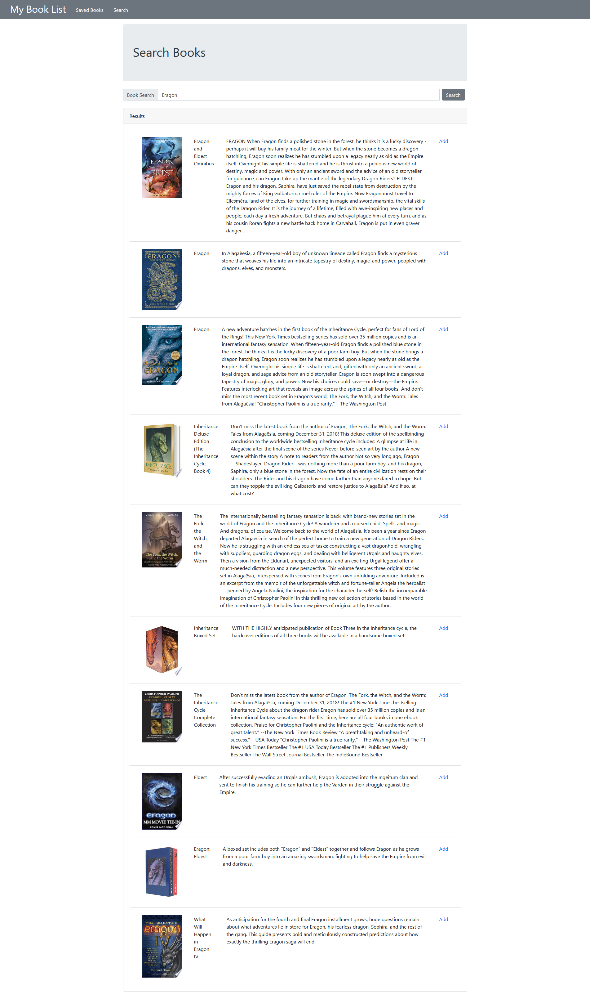

# Book List

[View Book List](https://thawing-refuge-28497.herokuapp.com/)

## Description

Search for Books that you want to read. Browse through available options, and save to your reading list.

## Table of Contents

* [Installation](#Installation)
* [Usage](#Usage)
* [Technologies](#Technologies)
* [License](#License)
* [Contribution](#Contribution)
* [Tests](#Tests)
* [Contact](#Contact)

## Installation

Clone from github repo. Navigate to root directory and run npm install. Include a .env on the root directory file with the format:

    #Server
    PORT=3001

    #Database
    MONGODB_URI={YOUR MONGODB URI HERE}

    #Google API
    GOOGLE_API_TOKEN={YOUR API TOKEN HERE}

On deployment you will also need to include these values in your production environment variables.

## Usage

Navigate the website using the links in the navigation bar located at the top of the screen. 

The "Saved Books" page will display all the books currently saved to the reading list. To remove a book, click the _remove_ link to the right of the description.

The "Search Books" page will allow you to search the Google Book API for books to add to the reading list. Search for a book title using the search bar at the top of the screen. Browse through the results list, and if you would like to add a book click the add link to the right of the description. This will add the book to the reading list database.

## Technologies

* React JS
* React Bootstrap
* NodeJS with Express
* MongoDB with Mongoose

## License

Book List is licensed under the [MIT](https://opensource.org/licenses/MIT) license.

## Contribution

N/A

## Tests

N/A

## Contact

Contact me at:

* Github: [https://github.com/nbur4556](https://github.com/nbur4556)
* Email: nbur4556@gmail.com